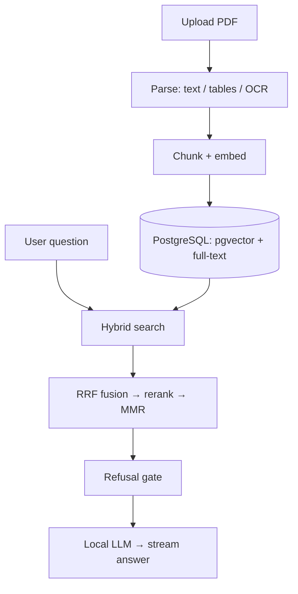
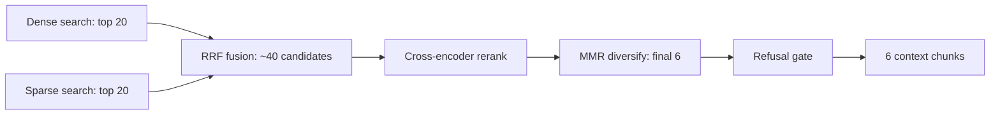
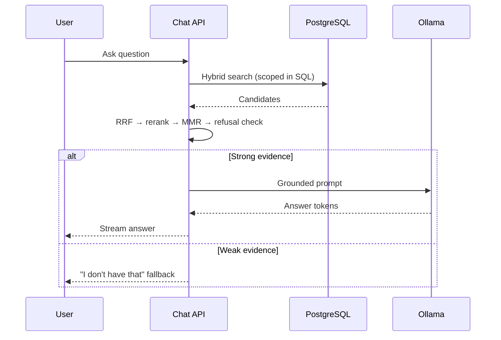

<h1 align="center">Enterprise RAG Platform</h1>

<p align="center">
  <b>A multi-tenant document-intelligence system that answers natural-language questions strictly from your own documents — hybrid retrieval, cross-encoder reranking, grounded refusal, and real-time streaming from a fully local LLM.</b>
</p>

<p align="center">
  Built so the <b>retrieval pipeline does the heavy lifting</b> — six ranking stages hand the model near-perfect context, so it produces sharp, grounded answers <b>even from a small ~2B-class model running locally</b>. No GPU farm, no per-token API bill, no data leaving the network.
</p>

<p align="center">
  
  
  
  
  
  
  
</p>

<p align="center">
  
  <br/><em>Admin console — per-project knowledge bases, document management, live API monitor, and domain controls</em>
</p>

<p align="center">
  
  <br/><em>Chat interface — natural-language answers, streamed token-by-token and grounded in source documents</em>
</p>

---

## Overview

Most "chat with your PDF" demos fall apart in a real organization: they can't tell which policy is authoritative, they leak one team's documents into another team's answers, and they cheerfully hallucinate when the answer simply isn't in the source material.

**Enterprise RAG Platform** is built for that reality. It ingests documents (including scanned PDFs, tables, and charts via a vision-OCR pipeline), stores project- and company-scoped knowledge, retrieves evidence through **dense + sparse hybrid search**, fuses rankings with **RRF**, sharpens precision with a **cross-encoder**, trims redundancy with **MMR**, refuses to answer when evidence is weak, and streams grounded answers from a **locally hosted LLM** — with tenant isolation enforced in SQL, not left to the model's goodwill.

> **Core principle:** a better answer starts with better evidence.

The full production architecture, the retrieval math and tuning reference, and the phased delivery roadmap live in **[PROJECT_PLAN.md](PROJECT_PLAN.md)**.

---

## Key Features

- **Multi-tenant knowledge spaces** — project-private documents plus company-wide shared policies, isolated at the database layer
- **Hybrid retrieval** — dense semantic search **and** PostgreSQL full-text search, run in parallel
- **Reciprocal Rank Fusion (RRF)** — merges two incompatible ranking systems cleanly
- **Cross-encoder reranking** — re-reads *question + passage together* for precision
- **MMR diversification** — removes near-duplicate context so the model sees complementary evidence
- **Grounded refusal** — below a relevance threshold, the system declines instead of hallucinating
- **Vision-OCR document ingestion** — every page is routed to the cheapest engine that can read it: PDF text layer for digital pages, PyMuPDF `find_tables` for digital tables, and the **GLM-OCR** vision model (0.9B, via Ollama) for scanned pages, tables and **charts/figures** — with Tesseract as the no-GPU fallback. Tables index as markdown, figures as text descriptions, both as atomic chunks. A pre-scan classifies each page in milliseconds and asks the admin before silently degrading rich content.
- **Background ingestion** — non-blocking uploads with observable `queued → running → done` (or `failed`, with the error captured) jobs
- **Sentence-aware, token-bounded chunking** — ~600 tokens with ~90-token overlap so answers that straddle a boundary aren't lost
- **Embeddable chat widget** — one `<script>` tag, Shadow-DOM isolated from host-page CSS, white-labeled via `data-*` attributes, with voice input, suggestion chips, and live Markdown / **table** / **chart** rendering
- **Tabbed admin console** — project management (create, rename, enable/disable, per-project embed & API panel), a live **API monitor** (hits by project and origin, hourly chart, request feed), a **domain whitelist** with an enforcement toggle, and global knowledge-base / cross-project-linking switches
- **Fully local inference** — embeddings and generation run on Ollama; no third-party API calls
- **OpenAI-compatible streaming API** — `/v1/chat/completions` with Server-Sent Events
- **XSS-safe Markdown rendering** — model output is escaped before it ever touches the DOM

---

## Architecture

Two journeys meet inside PostgreSQL: a document is **prepared once** on upload, then **read on every question**.



---

## The Retrieval Funnel

Every question passes through a funnel that starts **wide** (don't lose the right evidence) and ends **narrow** (hand the model only what matters). This staged design is what lets a small local model punch far above its weight.



Both searches run **per scope** (this project **+** the shared company scope) in parallel, so project and company evidence compete fairly before ranking.

| # | Stage | What it buys you |
|---|---|---|
| 1 | **Dense search** (meaning) | Catches paraphrases — *"time off"* ↔ *"annual leave"* |
| 2 | **Sparse search** (keywords) | Catches exact terms embeddings miss — policy codes, acronyms, IDs |
| 3 | **RRF fusion** | Merges both rankings without forcing incompatible scores onto one scale |
| 4 | **Cross-encoder rerank** | Reads question + chunk jointly for precision — run only on the shortlist |
| 5 | **MMR diversify** | Kills near-duplicates so 6 chunks cover 6 angles, not 1 restated 6× |
| 6 | **Grounded-refusal gate** | Weak evidence → a controlled *"I don't have that"* instead of a hallucination |

> **Two-stage by design:** the expensive cross-encoder never touches the full corpus — only the ~40 candidates that survive fusion. Broad recall stays cheap; final precision stays affordable.

---

## Multi-Tenant Isolation

The platform serves multiple applications from one deployment, each with private documents, alongside company-wide shared policies.

```text
Company Knowledge (shared, scope = company)
├── Leave Policy
├── Holiday Policy
└── Security Policy

Worklog Application            (slug: worklog)
├── Worklog SOP
└── Worklog Runbook

Vendor Management Application  (slug: vendor-management)
├── Vendor Onboarding Workflow
└── Vendor Management Runbook
```

A **Worklog Application** query may retrieve:

```text
Worklog documents  +  company-wide documents
```

…but **never** the Vendor Management Application's private documents. The boundary is enforced inside the database query, before ranking ever begins:

```sql
(scope = 'project' AND project_id = :current_project)
OR (scope = 'company')
```

> **The LLM is never treated as a security boundary.** Disallowed rows are filtered out in SQL, so another tenant's context can't even enter the prompt.

---

## Request Lifecycle



---

## Tech Stack

| Layer | Technology |
|---|---|
| Backend | **Python 3.12**, **FastAPI** — async endpoints, threadpool offloading for CPU-heavy retrieval |
| Database | **PostgreSQL** — `pgvector` (dense) + Full-Text Search / `tsvector` (sparse); **SQLAlchemy** ORM, **Alembic** migrations |
| PDF parsing / vision | **PyMuPDF** (text + `find_tables`), **GLM-OCR** vision model via Ollama, **Tesseract** OCR fallback (`pdf2image` + Poppler) for scanned pages |
| Chunking | **NLTK** sentence segmentation + **tiktoken** token budgeting, with overlap |
| Embeddings | **nomic-embed-text** via Ollama — local, 768-dimensional |
| Fusion | **Reciprocal Rank Fusion** |
| Reranking | **Cross-encoder** (`ms-marco-MiniLM-L-6-v2`) via sentence-transformers + PyTorch |
| Diversification | **Maximal Marginal Relevance** (λ = 0.7) |
| Generation | Local LLM via **Ollama** (`llama3.2`) — temperature `0.3`, capped output, kept warm via `keep_alive` |
| Resilience | **httpx** async streaming, **tenacity** retry/backoff |
| Streaming | **Server-Sent Events** |
| Frontend | HTML / CSS / vanilla JS — Shadow-DOM chat widget with safe Markdown rendering |

---

## Engineering Highlights

The parts that took the real work:

- **Per-page OCR routing** — a millisecond pre-scan classifies each page `digital` / `scanned` / `rich`, then routes it to the cheapest engine that can read it (text layer → `find_tables` → GLM-OCR vision → Tesseract), so digital pages stay instant and only genuinely hard pages pay the vision cost.
- **Non-blocking ingestion** — uploads return instantly; a background worker owns parsing, OCR, chunking, and embedding, and exposes honest job state (`queued → running → done`, or `failed` with the error captured — nothing fails silently).
- **Async that stays responsive** — CPU-bound embedding and reranking are offloaded to a threadpool so one heavy request never freezes every other live chat.
- **Two-stage retrieval economics** — cheap recall over the whole corpus, expensive cross-encoder only on the fused shortlist.
- **Structure-preserving documents** — tables serialize to markdown and figures to text descriptions, each kept as an atomic chunk so numeric tables and charts stay answerable.
- **Resilient embedding** — batched calls with retry + backoff so a transient Ollama hiccup doesn't kill a job.
- **Low perceived latency** — the model is kept warm (`keep_alive`), history is bounded to recent turns, and tokens stream to the browser as they're generated.
- **Prompt discipline** — a strict system prompt forces short, grounded, human answers and a controlled fallback when evidence is missing.
- **Clean re-ingestion** — re-uploading a document replaces its old chunks instead of duplicating them.

---

## Project Structure

```text
enterprise-rag-platform/
├── app/
│   ├── api/
│   │   ├── admin.py            # project + document management endpoints
│   │   ├── auth.py             # admin authentication
│   │   └── chat.py             # chat orchestration, prompt assembly, SSE streaming
│   └── main.py                 # FastAPI app entrypoint
├── core/
│   ├── config.py               # typed settings from .env (pydantic-settings)
│   ├── db.py                   # database engine / session
│   ├── models.py               # SQLAlchemy ORM models
│   ├── security.py             # API-key hashing, admin session tokens
│   └── app_settings.py         # runtime platform toggles
├── ingestion/
│   ├── analyzer.py             # rich-content pre-scan (digital / scanned / rich)
│   ├── parser.py               # per-page engine routing + OCR + normalization
│   ├── chunker.py              # sentence-aware, token-bounded chunking
│   ├── embedding.py            # local embedding generation (batched, retry)
│   └── worker.py               # background job processor
├── retrieval/
│   ├── vector_store.py         # dense + sparse search (scoped in SQL)
│   ├── engine.py               # RRF fusion · project boost · refusal threshold
│   ├── reranker.py             # cross-encoder scoring
│   └── mmr.py                  # diversity selection
├── static/
│   ├── admin.html              # tabbed admin console
│   └── chatbot.js              # streaming chat widget + safe Markdown rendering
├── migrations/                 # Alembic database migrations
├── scripts/                    # seed_db.py, diagnose.py, drop_all.py
├── tests/                      # unit tests
├── data/                       # uploaded documents (git-ignored)
├── images/                     # screenshots
├── .env.example
├── alembic.ini
├── requirements.txt
└── README.md
```

---

## Getting Started

**Prerequisites:** Python 3.12, PostgreSQL 14+ (with the `pgvector` extension), [Ollama](https://ollama.com), and — optionally, for the no-GPU OCR fallback — Tesseract OCR + Poppler.

```bash
# 1. Pull the local models
ollama pull nomic-embed-text
ollama pull llama3.2          # generation (or any small local model you prefer)
ollama pull glm-ocr           # optional — vision OCR for scans, tables & charts

# 2. Install dependencies
pip install -r requirements.txt

# 3. Configure environment
cp .env.example .env          # then edit: DB credentials, secret key, admin password, API key
#    Create the PostgreSQL database named in DB_NAME.

# 4. Create tables and seed the shared company scope + default admin
alembic upgrade head
python scripts/seed_db.py

# 5. Run the API and the ingestion worker (separate processes)
uvicorn app.main:app --host 0.0.0.0 --port 8000
python ingestion/worker.py    # or start_worker.bat on Windows
```

Then open the **admin console** at `http://localhost:8000/admin`, create a project, upload a PDF, wait for its job to read `done`, and ask a question in the chat widget. The **home page** at `http://localhost:8000/` is a product tour with a live layer-by-layer explorer of the retrieval pipeline.

---

## System Requirements

The heavy components are the LLM, the embedding model, and the PyTorch cross-encoder — not FastAPI/Postgres — so RAM and (optionally) a GPU drive the needs.

| Component | Minimum (dev / demo) | Recommended (self-host) |
|---|---|---|
| **CPU** | 4-core x86-64 | 8-core / 16-thread |
| **RAM** | **8 GB** (16 GB preferred) | **32 GB** |
| **GPU** | None (CPU works, slower) | NVIDIA 8 GB+ VRAM, CUDA |
| **Disk** | 15 GB SSD | 50 GB+ NVMe SSD |
| **OS** | Windows 10/11, macOS 12+, Ubuntu 20.04+ | Windows 11, macOS 13+, Ubuntu 22.04+ |

First run needs internet to download models and packages; afterwards it runs fully offline.

---

## API

The chat endpoint is **OpenAI-compatible**, so existing client SDKs work with a base-URL swap.

**Chat completion**

```http
POST /api/{project_slug}/v1/chat/completions
Content-Type: application/json
```

```json
{
  "messages": [
    { "role": "user", "content": "What is the approval process?" }
  ]
}
```

Streaming response (Server-Sent Events):

```text
data: {"content":"The"}
data: {"content":" approval"}
data: {"content":" process"}
data: {"content":" requires..."}
data: [DONE]
```

---

## Key Design Decisions

| Decision | Reason |
|---|---|
| Dense **+** sparse retrieval | Capture both meaning and exact terminology |
| RRF fusion | Merge incompatible ranking systems without brittle score normalization |
| Cross-encoder reranking | Recover precision after broad, recall-oriented retrieval |
| MMR | Trim repetitive context so the model sees complementary evidence |
| SQL-level scope filtering | Prevent cross-tenant leakage without trusting the model |
| Per-page OCR routing | Pay the vision cost only for pages that actually need it |
| Background ingestion | Keep OCR and embedding off the request path |
| Local inference | Full control over sensitive knowledge; no per-token API cost |
| SSE streaming | Cut perceived latency to first token |

---

## Challenges Solved

| Challenge | Solution |
|---|---|
| Scanned, image-only PDFs | GLM-OCR vision model, Tesseract fallback |
| Tables flattened into number soup | PyMuPDF `find_tables` → markdown, kept as atomic chunks |
| Charts / figures invisible to search | Vision figure descriptions indexed as text |
| Exact terms missed by embeddings | Sparse full-text retrieval |
| Paraphrases missed by keyword search | Dense semantic retrieval |
| Incompatible search score scales | RRF fusion |
| Weak first-stage precision | Cross-encoder reranking |
| Repetitive context | MMR diversification |
| Cross-tenant leakage risk | SQL-level scope filtering |
| Hallucination under weak evidence | Grounded-refusal threshold |
| Slow perceived generation | SSE token streaming + warm model |
| Expensive document processing | Background worker with job lifecycle |

---

## Evaluating Retrieval Quality

Retrieval is built to be measured, not assumed. Because each stage is independently switchable, quality can be attributed stage-by-stage with an ablation:

```text
dense only  →  sparse only  →  dense + sparse  →  + RRF  →  + cross-encoder  →  + MMR
```

Comparing recall and ranking metrics across these configurations shows whether each stage earns its place, rather than stacking components on faith.

---

## Performance & Optimizations

Designed for low latency on modest hardware:

- **Warm model** via `keep_alive` → fast time-to-first-token
- **Streaming** responses → immediate feedback instead of waiting for full generation
- **Bounded conversation history** → small, fast prompts
- **Two-stage retrieval** → the costly reranker runs on ~40 candidates, not the whole corpus
- **Batched embeddings** with retry/backoff → resilient, efficient ingestion
- **Threadpool offloading** → the async event loop stays responsive under load
- **Indexed search** → `pgvector` for dense similarity + GIN-indexed `tsvector` for full-text

---

## Security

- **Tenant isolation enforced in SQL** — disallowed documents never reach the prompt
- **Per-project hashed API keys** — the chat widget authenticates with a bearer token; admin sessions use signed tokens
- **Grounded refusal** — the model can't invent answers when evidence is missing
- **XSS-safe rendering** — model output is escaped before insertion into the DOM
- **Local inference** — sensitive documents never leave the network
- **Environment-based secrets** — configuration via `.env`, with an `.env.example` template

---

## What This Project Demonstrates

Production-oriented RAG and information-retrieval engineering: hybrid dense/sparse search, rank fusion, cross-encoder reranking, MMR diversification, grounded refusal, vision-OCR document pipelines, multi-tenant data isolation, asynchronous background processing, local LLM deployment, and streaming AI interfaces on a FastAPI + PostgreSQL backend.

---

## Author

**Anurag Singh** — AI & Data Engineer focused on production RAG systems, retrieval engineering, NLP, local LLMs, and AI-backed applications.

- LinkedIn: https://linkedin.com/in/anurag2050
- GitHub: https://github.com/anuragroque

---

## License

Released under the **MIT License** — see [`LICENSE`](LICENSE).

<p align="center"><em>A better answer starts with better evidence.</em></p>
